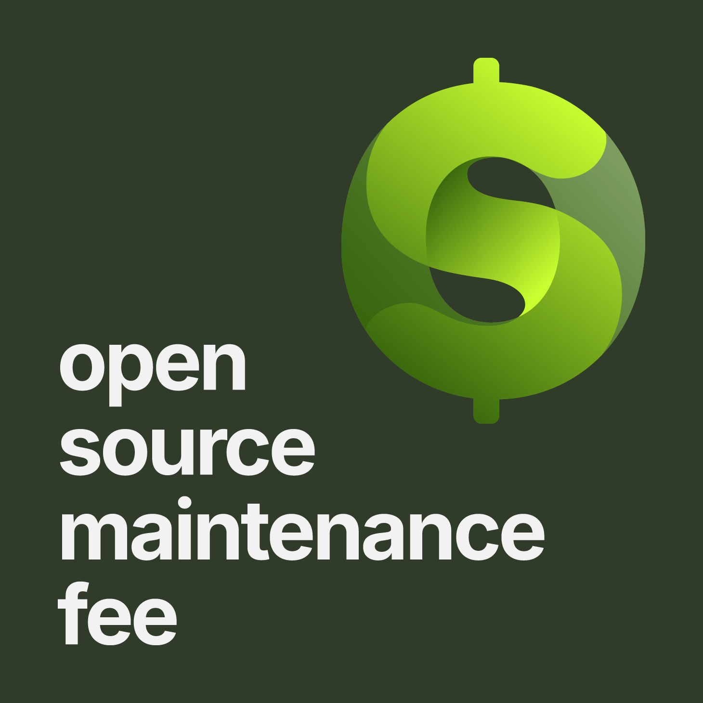

# Windows-Recall-Switch
This Program Enables And Disables Microsoft Windows Recall Feature.

## Download
[](https://github.com/rc-chuah/Windows-Recall-Switch/releases/latest)
[](https://github.com/RaynerSec/Windows-Recall-Switch/releases/latest)

## Open Source Maintenance Fee

<a href="https://opensourcemaintenancefee.org/"></a>

To Ensure The Long-Term Sustainability Of This Project, Use Of The Windows-Recall-Switch Requires An [Open Source Maintenance Fee](https://opensourcemaintenancefee.org). While The Source Code Is Freely Available Under The Terms Of The [LICENSE](./LICENSE), All Other Aspects Of The Project--Including Opening Or Commenting On Issues, Participating In Discussions And Downloading Releases--Require [Adherence To The Maintenance Fee](./OSMFEULA.txt).

In Short, If You Use This Project To Generate Revenue, The [Maintenance Fee Is Required](./OSMFEULA.txt).

To Pay The Maintenance Fee, [Become A Sponsor](https://github.com/sponsors/raynersec).

## Building
### Building Perquisites
#### Visual Studio
- Visual Studio 2022 Or Later
### Building Windows-Recall-Switch
#### Get The Source Code
- Get The Source Code Either By Downloading Zip From Mirror 1 [Download Zip](https://github.com/rc-chuah/Windows-Recall-Switch/archive/main.zip) Or Do `git clone https://github.com/rc-chuah/Windows-Recall-Switch`
- Get The Source Code Either By Downloading Zip From Mirror 2 [Download Zip](https://github.com/RaynerSec/Windows-Recall-Switch/archive/main.zip) Or Do `git clone https://github.com/RaynerSec/Windows-Recall-Switch`
#### Compile The Source Code
- Compile It In Visual Studio

## Features
### This Tool Was Made For:
- Disable Microsoft Windows Recall Without Uninstalling Features Or Changing The Installation In Windows.
- Do All Of The Above Quickly And Automatically.

## Usage
### How To Use Windows-Recall-Switch
#### How To Use Windows-Recall-Switch Using WinGet (Windows Package Manager)
#### Install Windows-Recall-Switch
```powershell
winget install --id RaynerSec.Windows-Recall-Switch -e
```
#### Update Windows-Recall-Switch
```powershell
winget upgrade --id RaynerSec.Windows-Recall-Switch -e
```
#### How To Use Windows-Recall-Switch 32 Bit (x86) Installer
- Download Windows-Recall-Switch 32 Bit (x86) Installer
- [Download Mirror 1](https://github.com/rc-chuah/Windows-Recall-Switch/releases/latest) | [Download Mirror 2](https://github.com/RaynerSec/Windows-Recall-Switch/releases/latest)
- Run Windows-Recall-Switch 32 Bit (x86) Installer
- Accept The UAC Prompt
- Follow On Screen Instructions And You're Done
#### How To Use Windows-Recall-Switch 64 Bit (x64) Installer
- Download Windows-Recall-Switch 64 Bit (x64) Installer
- [Download Mirror 1](https://github.com/rc-chuah/Windows-Recall-Switch/releases/latest) | [Download Mirror 2](https://github.com/RaynerSec/Windows-Recall-Switch/releases/latest)
- Run Windows-Recall-Switch 64 Bit (x64) Installer
- Accept The UAC Prompt
- Follow On Screen Instructions And You're Done
#### How To Use Windows-Recall-Switch Portable Version
- Download And Install The Latest Microsoft Visual C/C++ Redistributable 2015-2022 (x86/x64) (Required)
- [Download 32 Bit (x86)](https://aka.ms/vs/17/release/vc_redist.x86.exe) | [Download 64 Bit (x64)](https://aka.ms/vs/17/release/vc_redist.x64.exe)
- Download Windows-Recall-Switch Portable Zip File
- [Download Mirror 1](https://github.com/rc-chuah/Windows-Recall-Switch/releases/latest) | [Download Mirror 2](https://github.com/RaynerSec/Windows-Recall-Switch/releases/latest)
- Unzip Windows-Recall-Switch Portable Zip File
- If Your Machine Architecture Is 32 Bit (x86) Then Run Windows-Recall-Switch-x86.exe
- If Your Machine Architecture Is 64 Bit (x64) Then Run Windows-Recall-Switch-x64.exe
- If Your Machine Architecture Is 64 Bit (Arm64) Then Run Windows-Recall-Switch-Arm64.exe
- If Your Machine Architecture Is 64 Bit (Arm64) That Supports (Arm64EC And/Or Arm64X) Then Run Windows-Recall-Switch-Arm64EC-Arm64X.exe
- Accept The UAC Prompt
- Follow On Screen Usage And You're Done

## Star History (Mirror 1)
<a href="https://www.star-history.com/#rc-chuah/Windows-Recall-Switch&Date">
 <picture>
   <source media="(prefers-color-scheme: dark)" srcset="https://api.star-history.com/svg?repos=rc-chuah/Windows-Recall-Switch&type=Date&theme=dark" />
   <source media="(prefers-color-scheme: light)" srcset="https://api.star-history.com/svg?repos=rc-chuah/Windows-Recall-Switch&type=Date" />
   
 </picture>
</a>

## Star History (Mirror 2)
<a href="https://www.star-history.com/#RaynerSec/Windows-Recall-Switch&Date">
 <picture>
   <source media="(prefers-color-scheme: dark)" srcset="https://api.star-history.com/svg?repos=RaynerSec/Windows-Recall-Switch&type=Date&theme=dark" />
   <source media="(prefers-color-scheme: light)" srcset="https://api.star-history.com/svg?repos=RaynerSec/Windows-Recall-Switch&type=Date" />
   
 </picture>
</a>

## Stargazers Over Time (Mirror 1)
[](https://starchart.cc/rc-chuah/Windows-Recall-Switch)

## Stargazers Over Time (Mirror 2)
[](https://starchart.cc/RaynerSec/Windows-Recall-Switch)

## Special Thanks
- Thanks To [Advanced Installer](https://www.advancedinstaller.com) For Providing A Professional License For Free For This Project.